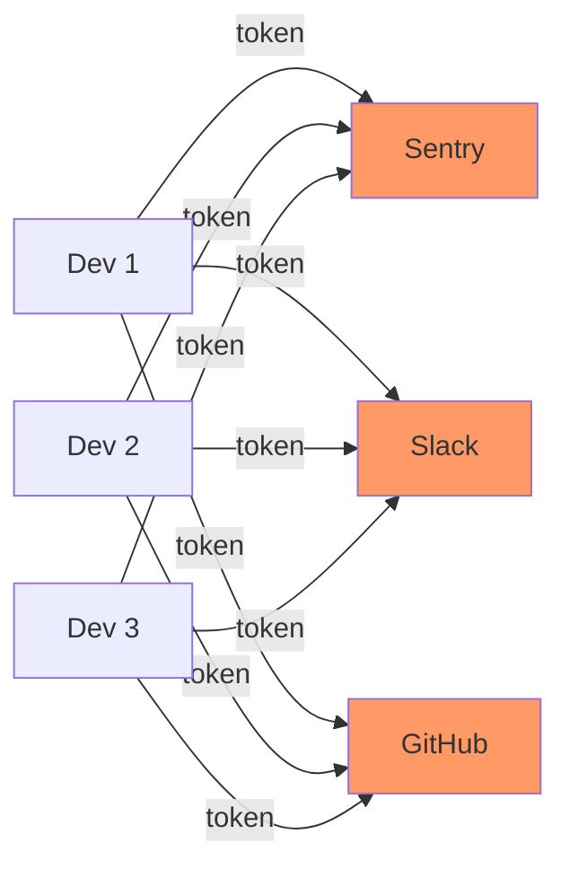
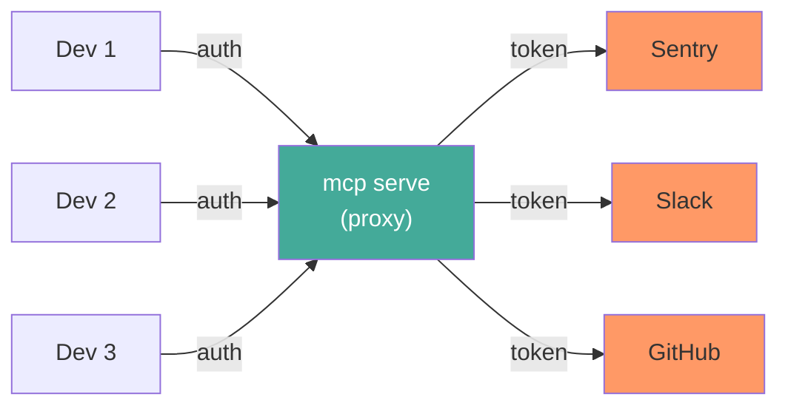
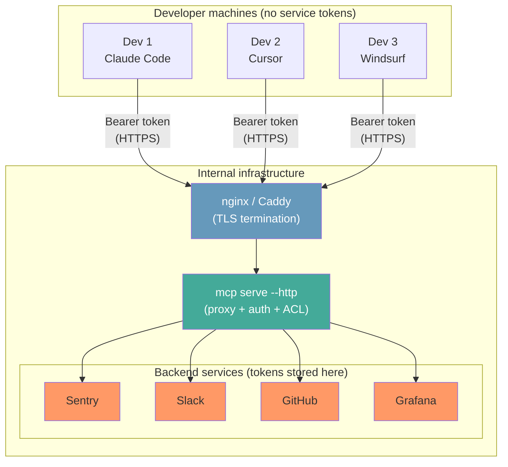

# Token sprawl in enterprise teams

## The problem

A company with 50 engineers using AI tools (Claude Code, Cursor, Windsurf) needs access to Sentry, Slack, GitHub, Grafana, and a few internal services. Each service requires an API token. Each engineer needs their own tokens.

The math gets ugly fast:

| Engineers | Services | Tokens to manage |
|-----------|----------|-----------------|
| 10 | 5 | 50 |
| 50 | 8 | 400 |
| 200 | 12 | 2,400 |

Every token is a secret. Every secret is a liability. Every engineer's laptop is an attack surface.

Now multiply by the number of AI tools each engineer uses. Claude Code needs a `servers.json`. Cursor needs another. Windsurf needs a third. Same tokens, copied across machines, across config files, across tools.

**What actually goes wrong:**

- **Onboarding takes hours** — new engineer joins, needs tokens for 8 services. Opens 8 dashboards, generates 8 tokens, pastes them into 3 config files. One typo somewhere. Debug time.
- **Offboarding is incomplete** — engineer leaves, someone revokes their GitHub token but forgets the Sentry one. The Grafana token lives on a laptop image that gets recycled.
- **Token rotation is a myth** — security policy says rotate every 90 days. Nobody does it because it means updating tokens across every developer machine, every config file, every tool.
- **Audit is impossible** — "who has access to what?" requires checking every engineer's local config. There's no central log. No visibility.
- **Scope creep** — engineers generate broad-access tokens because it's easier than figuring out the minimum permissions. One leaked token exposes everything.

## The fix: one proxy, zero tokens on developer machines

Instead of distributing tokens to every engineer, run one MCP proxy on internal infrastructure. The proxy holds the service tokens. Engineers connect to the proxy.

**Before** — every dev holds tokens for every service:



> 50 devs × 8 services = **400 tokens** scattered across laptops.

**After** — one proxy holds the tokens, devs connect once:



> 50 devs × 1 connection = **50 auth credentials**, centrally managed.

Service tokens live in one place. If you need to rotate the Sentry token, you update it once on the proxy. Zero touch on developer machines.

## How to set it up

### 1. Deploy the proxy

On a shared server (VM, container, Kubernetes pod):

```bash
mcp serve --http 0.0.0.0:8080 --insecure
```

> In production, put a reverse proxy (nginx, Caddy) in front for TLS. See the [proxy mode guide](proxy-mode.md#production-deployment) for details.

### 2. Configure backend tokens on the proxy

The proxy's `servers.json` holds all service tokens:

```json
{
  "mcpServers": {
    "sentry": {
      "url": "https://mcp.sentry.dev/sse",
      "headers": { "Authorization": "Bearer ${SENTRY_TOKEN}" }
    },
    "slack": {
      "command": "npx",
      "args": ["-y", "@anthropic-ai/mcp-server-slack"],
      "env": { "SLACK_BOT_TOKEN": "${SLACK_TOKEN}" }
    },
    "github": {
      "command": "npx",
      "args": ["-y", "@modelcontextprotocol/server-github"],
      "env": { "GITHUB_PERSONAL_ACCESS_TOKEN": "${GITHUB_TOKEN}" }
    }
  }
}
```

All secrets stay on the server. Engineers never see them.

### 3. Add per-user authentication

Use bearer tokens to identify each engineer and control access:

```json
{
  "mcpServers": { ... },
  "serverAuth": {
    "provider": "bearer",
    "bearer": {
      "tokens": {
        "eng-alice-a1b2c3": "alice",
        "eng-bob-d4e5f6": "bob",
        "eng-carol-g7h8i9": "carol"
      }
    },
    "acl": {
      "default": "allow",
      "rules": [
        { "subjects": ["carol"], "tools": ["sentry__*"], "policy": "deny" }
      ]
    }
  }
}
```

Or, if you already have an identity provider behind a reverse proxy:

```json
{
  "serverAuth": {
    "provider": "forwarded",
    "forwarded": { "header": "x-forwarded-user" }
  }
}
```

See the [proxy mode authentication docs](proxy-mode.md#authentication) for all provider options.

### 4. Engineers connect — one line

Each engineer adds one entry to their local config:

```bash
mcp add --url https://mcp.internal:8443/mcp team
```

That's it. Every AI tool on their machine connects through this one endpoint. No service tokens on their laptop. No per-service config.

```json
{
  "mcpServers": {
    "team": {
      "url": "https://mcp.internal:8443/mcp",
      "headers": { "Authorization": "Bearer eng-alice-a1b2c3" }
    }
  }
}
```

## What you gain

**Onboarding in minutes** — new engineer gets one proxy token. Immediately has access to all approved tools. No 8-service token generation dance.

**Offboarding in seconds** — remove the engineer's token from the proxy config. Access to everything is revoked instantly. No forgotten tokens on decommissioned laptops.

**Token rotation without pain** — rotate a service token on the proxy, no engineer even notices. Zero coordination, zero downtime.

**Audit in one place** — proxy logs show who called which tool, when. One log stream, one place to look.

**Least privilege by default** — ACL rules control which engineers can use which tools. Carol from marketing can use Slack tools but not Sentry admin tools.

**Tool-agnostic** — engineers can use Claude Code, Cursor, Windsurf, or any MCP-compatible client. All connect to the same proxy. Add or remove AI tools without touching service credentials.

## Architecture



## Further reading

- [Proxy mode](proxy-mode.md) — full technical guide on stdio/HTTP modes, endpoints, and configuration
- [Proxy mode authentication](proxy-mode.md#authentication) — bearer tokens, forwarded user, and ACL rules
- [Config file reference](../reference/config-file.md#server-authentication-serverauth) — serverAuth schema
