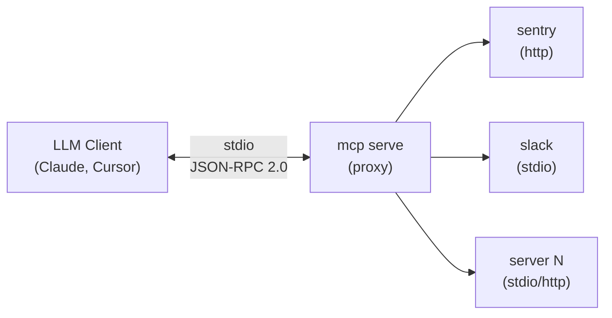

# Proxy mode

`mcp serve` starts a single MCP server that aggregates all your configured backends. Any MCP-compatible client connects once and gets access to every tool from every server in your `servers.json`.

## The problem

Without proxy mode, every LLM tool (Claude Code, Cursor, Windsurf, etc.) needs its own copy of your MCP server configuration. Add a new server? Update it in 3 places. Change a token? Same. The config drifts, breaks, and wastes time.

## How it works



1. Client sends `initialize` — the proxy responds immediately with capabilities
2. Client calls `tools/list` — the proxy connects to all backends (lazy), merges their tool lists
3. Client calls `tools/call` — the proxy routes to the correct backend

## Tool namespacing

Tools are prefixed with the server name using double underscore (`__`) as separator:

| Server | Original tool | Namespaced tool |
|--------|--------------|-----------------|
| sentry | `search_issues` | `sentry__search_issues` |
| slack | `send_message` | `slack__send_message` |
| github | `list_repos` | `github__list_repos` |

Descriptions are also prefixed: `[sentry] Search for issues in Sentry`.

This prevents collisions when two servers expose a tool with the same name.

## Usage

```bash
mcp serve
```

That's it. It reads the same `servers.json` (or `$MCP_CONFIG_PATH`) and connects to everything.

Diagnostics go to stderr:

```
[serve] connecting to sentry...
[serve] sentry: 8 tool(s)
[serve] connecting to slack...
[serve] slack: 12 tool(s)
[serve] ready — 2 backend(s), 20 tool(s)
```

## Client configuration

### Claude Code

In your Claude Code MCP settings (`.claude/mcp.json` or via Claude Code settings):

```json
{
  "mcpServers": {
    "all": {
      "command": "mcp",
      "args": ["serve"]
    }
  }
}
```

Now every tool from every backend is available in Claude Code through a single connection.

### Cursor

In `.cursor/mcp.json`:

```json
{
  "mcpServers": {
    "mcp-proxy": {
      "command": "mcp",
      "args": ["serve"]
    }
  }
}
```

### Windsurf

In your Windsurf MCP config:

```json
{
  "mcpServers": {
    "mcp-proxy": {
      "command": "mcp",
      "args": ["serve"]
    }
  }
}
```

### Any MCP client (generic stdio)

Any client that supports stdio transport can use it. The proxy speaks standard JSON-RPC 2.0 over MCP protocol on stdin/stdout.

```bash
# Manual test — list tools
echo '{"jsonrpc":"2.0","id":1,"method":"initialize","params":{"protocolVersion":"2025-03-26","capabilities":{},"clientInfo":{"name":"test","version":"0.1"}}}' | mcp serve 2>/dev/null
```

## Error handling

- **Backend fails to connect** — logged to stderr, skipped. Other backends still work.
- **Backend disconnects mid-session** — `tools/call` returns an MCP error with context about which backend failed.
- **Unknown tool** — returns a JSON-RPC error with the unknown tool name.

The proxy never crashes because one backend is down. It degrades gracefully.

## Environment variables

All standard `mcp` env vars apply:

| Variable | Effect |
|----------|--------|
| `MCP_CONFIG_PATH` | Custom config file path |
| `MCP_TIMEOUT` | Timeout in seconds for backend connections (default: 60) |

## When to use proxy mode

| Scenario | Use proxy? |
|----------|-----------|
| Multiple LLM tools need the same MCP servers | Yes |
| You want a single source of truth for server config | Yes |
| You're calling one tool from a script | No — use `mcp <server> <tool>` directly |
| You need maximum performance for a single server | No — direct connection avoids the proxy hop |
