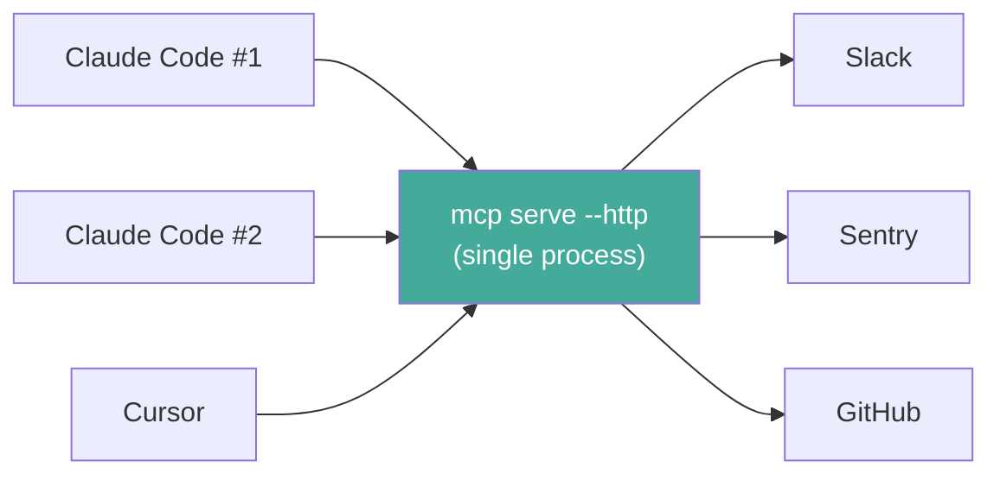
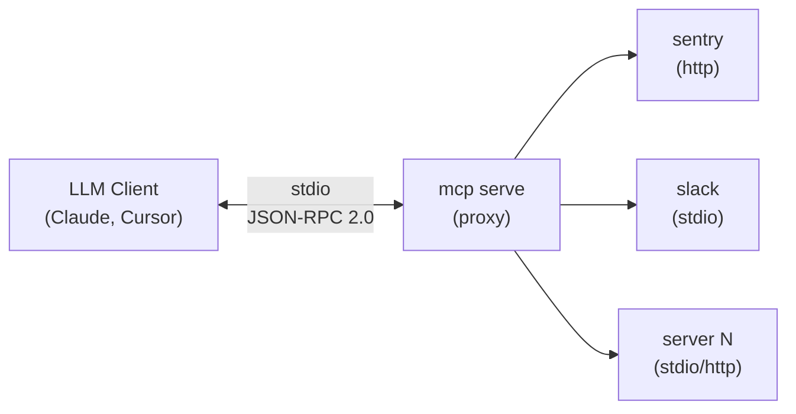
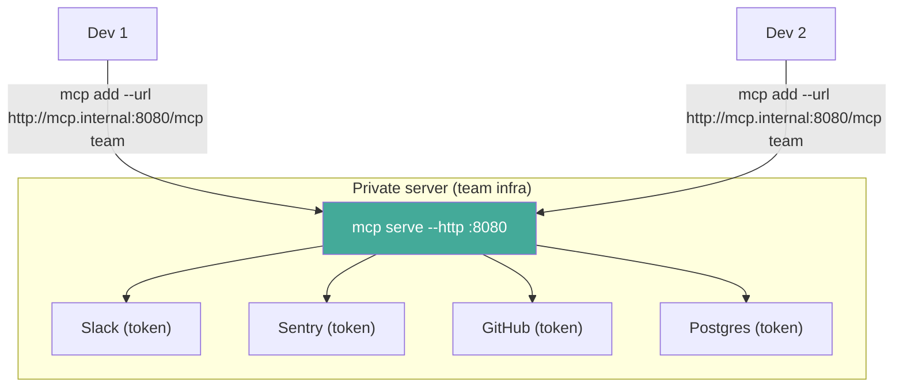
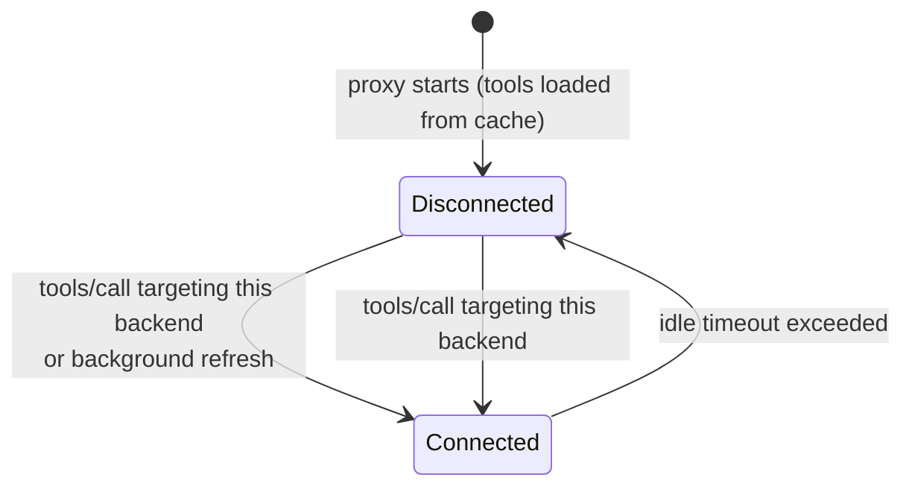

# Proxy mode

`mcp serve` starts a single MCP server that aggregates all your configured backends. Any MCP-compatible client connects once and gets access to every tool from every server in your `servers.json`.

## The problem

Without proxy mode, every LLM tool (Claude Code, Cursor, Windsurf, etc.) needs its own copy of your MCP server configuration. Add a new server? Update it in 3 places. Change a token? Same. The config drifts, breaks, and wastes time.

There's another problem: **resource waste**. When you configure MCP servers with `command` in `mcpServers`, each client session spawns its own copy of every server process. Open 5 Claude Code sessions and you get 5 copies of every MCP server — easily 3-4 GB of RAM wasted on duplicate processes.

### Stdio vs HTTP: when to use each

| Approach | How it works | Trade-off |
|----------|-------------|-----------|
| `"command": "mcp", "args": ["serve"]` | Each session spawns a new proxy (which spawns all backends) | Simple, but duplicates everything per session |
| `"type": "sse", "url": "http://…/mcp/sse"` | All sessions share one persistent proxy | One process, one set of backends, zero duplication |

**Recommendation:** Run `mcp serve --http` as a persistent service (systemd, launchd, etc.) and point all your clients to it via SSE. This gives you a single set of backend connections shared across every session, every client, every terminal.



## How it works



1. Client sends `initialize` — the proxy responds immediately with capabilities
2. Client calls `tools/list` — the proxy returns tools instantly from persistent cache (if available), while refreshing from real backends in the background. On first run, it connects to all backends to discover their tool lists.
3. Client calls `tools/call` — the proxy reconnects the target backend on demand (if it was shut down), routes the request, and tracks usage for adaptive timeout

## Tool namespacing

Tools are prefixed with the server name using double underscore (`__`) as separator:

| Server | Original tool | Namespaced tool |
|--------|--------------|-----------------|
| sentry | `search_issues` | `sentry__search_issues` |
| slack | `send_message` | `slack__send_message` |
| github | `list_repos` | `github__list_repos` |

Descriptions are also prefixed: `[sentry] Search for issues in Sentry`.

This prevents collisions when two servers expose a tool with the same name.

## Stdio mode (default)

```bash
mcp serve
```

That's it. It reads the same `servers.json` (or `$MCP_CONFIG_PATH`) and connects to everything.

Diagnostics go to stderr:

```
[serve] discovering tools from sentry...
[serve] sentry: 8 tool(s)
[serve] discovering tools from slack...
[serve] slack: 12 tool(s)
[serve] ready — 2 backend(s), 20 tool(s)
[serve] shutting down idle backend: sentry (idle 62s, 0 reqs)
[serve] connecting to sentry... (on next tools/call)
[serve] sentry: 8 tool(s) (reconnected)
```

## HTTP mode

Expose the proxy as an HTTP server so multiple developers can share a single MCP endpoint:

```bash
mcp serve --http
```

This starts an HTTP server on `127.0.0.1:8080` (localhost only, by default).

### Custom bind address

```bash
mcp serve --http 0.0.0.0:9090 --insecure
```

> **Security:** Non-loopback addresses require the `--insecure` flag. Without TLS, binding to `0.0.0.0` exposes the proxy to the network in plaintext. Use a reverse proxy (nginx, Caddy) with TLS in production.

### Endpoints

| Method | Path | Description |
|--------|------|-------------|
| `POST` | `/mcp` | JSON-RPC 2.0 request/response (Streamable HTTP) |
| `GET` | `/mcp` | SSE stream (same as `/mcp/sse`, for backward compatibility) |
| `GET` | `/mcp/sse` | SSE stream (old HTTP+SSE transport) |
| `GET` | `/health` | Health check (JSON) |

The proxy supports both the **Streamable HTTP** transport (protocol version `2025-11-25`) and the older **HTTP+SSE** transport (`2024-11-05`) for backward compatibility.

### POST /mcp

Send any MCP JSON-RPC request and get the response. Supports both requests (with `id`) and notifications (without `id`):

```bash
# Initialize
curl -s http://localhost:8080/mcp \
  -H "Content-Type: application/json" \
  -d '{"jsonrpc":"2.0","id":1,"method":"initialize","params":{"protocolVersion":"2025-11-25","capabilities":{},"clientInfo":{"name":"test","version":"0.1"}}}'

# Send initialized notification (no id — returns 202)
curl -s http://localhost:8080/mcp \
  -H "Content-Type: application/json" \
  -d '{"jsonrpc":"2.0","method":"notifications/initialized"}'

# List tools
curl -s http://localhost:8080/mcp \
  -H "Content-Type: application/json" \
  -d '{"jsonrpc":"2.0","id":2,"method":"tools/list"}'

# Call a tool
curl -s http://localhost:8080/mcp \
  -H "Content-Type: application/json" \
  -d '{"jsonrpc":"2.0","id":3,"method":"tools/call","params":{"name":"sentry__search_issues","arguments":{"query":"is:unresolved"}}}'
```

When used with an SSE session (`?session_id=<uuid>`), responses are delivered via the SSE stream and the POST returns `202 Accepted`.

### GET /mcp/sse

SSE endpoint for clients that use the old HTTP+SSE transport (protocol version `2024-11-05`). On connect, the server sends an `endpoint` event with the URL to POST requests to:

```
event: endpoint
data: /mcp?session_id=<uuid>
```

JSON-RPC responses are delivered as `message` events on the SSE stream. The connection stays open with periodic pings (every 15 seconds) to keep it alive. Sessions are cleaned up automatically when the client disconnects.

### GET /health

Returns the proxy status:

```json
{
  "status": "ok",
  "backends_configured": 3,
  "backends_connected": 1,
  "tools": 20,
  "version": "0.3.0"
}
```

### Graceful shutdown

The HTTP server shuts down cleanly on `SIGTERM` or `SIGINT` (Ctrl+C). It stops accepting new connections, finishes in-flight requests, and disconnects all backends.

### Team setup

Run one proxy server on shared infrastructure. Every developer connects to it:



Tokens stay on the server. Developers just connect. For a deeper look at the enterprise use case, see [Enterprise token management](enterprise-token-management.md).

## Client configuration

### Claude Code (stdio)

In your Claude Code MCP settings (`.claude/mcp.json` or via Claude Code settings):

```json
{
  "mcpServers": {
    "all": {
      "command": "mcp",
      "args": ["serve"]
    }
  }
}
```

### Claude Code (HTTP — shared server)

Use the SSE transport type pointing to the `/mcp/sse` endpoint:

```json
{
  "mcpServers": {
    "team": {
      "type": "sse",
      "url": "http://localhost:8080/mcp/sse"
    }
  }
}
```

> **Note:** The Streamable HTTP transport (`type: "http"`) requires OAuth which is not yet supported. Use `type: "sse"` for now.

### Cursor (stdio)

In `.cursor/mcp.json`:

```json
{
  "mcpServers": {
    "mcp-proxy": {
      "command": "mcp",
      "args": ["serve"]
    }
  }
}
```

### Cursor (HTTP — shared server)

```json
{
  "mcpServers": {
    "team": {
      "url": "http://mcp.internal:8080/mcp"
    }
  }
}
```

### Windsurf

In your Windsurf MCP config:

```json
{
  "mcpServers": {
    "mcp-proxy": {
      "command": "mcp",
      "args": ["serve"]
    }
  }
}
```

### Any MCP client (generic stdio)

Any client that supports stdio transport can use it. The proxy speaks standard JSON-RPC 2.0 over MCP protocol on stdin/stdout.

```bash
# Manual test — list tools
echo '{"jsonrpc":"2.0","id":1,"method":"initialize","params":{"protocolVersion":"2025-11-25","capabilities":{},"clientInfo":{"name":"test","version":"0.1"}}}' | mcp serve 2>/dev/null
```

### Any MCP client (HTTP)

Any client that supports HTTP transport can connect to the HTTP endpoint:

```bash
mcp add --url http://localhost:8080/mcp local-proxy
```

## Persistent tool cache

The proxy caches discovered tools in a local [ChronDB](https://chrondb.avelino.run/) database so that subsequent startups serve tools instantly — no need to wait for backends to connect.

### How it works

On startup, the proxy loads cached tools and serves them immediately. A background task then connects to real backends to refresh the cache. If a backend's configuration changes (detected via SHA-256 hash), its cached entry is invalidated and re-discovered.

First run with no cache falls back to blocking discovery (connecting to all backends before responding).

### Cache invalidation

The cache is invalidated per-backend when:
- The backend's config in `servers.json` changes (command, args, url, env, etc.)
- The backend is removed from config (cache entry is ignored)

Cache location: `~/.config/mcp/db/` (shared database with audit logs, separated by key prefix).

## Lazy initialization and idle shutdown

The proxy does **not** keep all backends running permanently. It uses a lazy initialization strategy combined with adaptive idle shutdown to minimize resource usage.

### How it works



1. **Startup** — No backends are connected. Cached tools are loaded from the local database and served immediately.
2. **Background refresh** — The proxy connects to all backends in the background, refreshes tool lists, and updates the cache. Clients are not blocked.
3. **Idle shutdown** — A background task checks every 30 seconds for idle backends. If a backend exceeds its idle timeout, it is shut down. Its tools remain visible in `tools/list`.
4. **On-demand reconnect** — When `tools/call` targets a disconnected backend, the proxy reconnects it transparently, refreshes the tool cache, and forwards the request.

Usage statistics (request count, frequency) are preserved across reconnections, so the adaptive timeout algorithm maintains continuity.

### Adaptive timeout tiers

The default idle timeout is `adaptive`. The proxy classifies each backend by its usage frequency:

| Tier | Requests/hour | Idle timeout |
|------|--------------|-------------|
| **Hot** | > 20 | 5 min |
| **Warm** | 5–20 | 3 min |
| **Cold** | < 5 | 1 min |

Backends with fewer than 2 requests use the minimum timeout (default: 1 min).

### Configuring idle timeout

Per-backend in `servers.json`:

```json
{
  "mcpServers": {
    "slack": {
      "command": "npx",
      "args": ["@anthropic/mcp-slack"],
      "idle_timeout": "adaptive"
    },
    "sentry": {
      "url": "https://mcp.sentry.io",
      "idle_timeout": "never"
    },
    "github": {
      "command": "npx",
      "args": ["@modelcontextprotocol/server-github"],
      "idle_timeout": "2m",
      "min_idle_timeout": "30s",
      "max_idle_timeout": "5m"
    }
  }
}
```

| Value | Behavior |
|-------|----------|
| `"adaptive"` (default) | Usage-based timeout with automatic tier assignment |
| `"never"` | Keep alive forever (old behavior) |
| `"<duration>"` | Fixed timeout (e.g. `"2m"`, `"30s"`, `"1h"`) |

See the [config file reference](../reference/config-file.md#idle-timeout) for full details.

### Why this matters

With 10 MCP servers configured and 3 Claude Code sessions open:
- **Before:** 30 backend processes running permanently (~3-4 GB RAM)
- **After:** Only the backends you're actively using stay alive. Idle ones are shut down within 1-5 minutes and reconnected on demand.

## Error handling

- **Backend fails to connect** — logged to stderr, skipped. Other backends still work.
- **Backend disconnected (idle shutdown)** — `tools/call` reconnects the backend transparently. If reconnection fails, returns an MCP error with context.
- **Backend disconnects mid-session** — `tools/call` returns an MCP error with context about which backend failed.
- **Unknown tool** — returns a JSON-RPC error with the unknown tool name.
- **Malformed JSON-RPC** — HTTP mode returns a parse error with details. Stdio mode silently ignores.

The proxy never crashes because one backend is down. It degrades gracefully.

## Authentication

The proxy supports server-side authentication for HTTP mode. Authentication is configured via `serverAuth` in `servers.json`.

### No auth (default)

By default, no authentication is required. This is suitable for local development and stdio mode.

### Bearer token auth

Static token-to-user mapping. Each token maps to a subject identity:

```json
{
  "mcpServers": { ... },
  "serverAuth": {
    "provider": "bearer",
    "bearer": {
      "tokens": {
        "secret-token-abc": "alice",
        "secret-token-def": "bob"
      }
    }
  }
}
```

Clients pass the token in the `Authorization` header:

```bash
curl -s http://localhost:8080/mcp \
  -H "Authorization: Bearer secret-token-abc" \
  -H "Content-Type: application/json" \
  -d '{"jsonrpc":"2.0","id":1,"method":"tools/list"}'
```

### Forwarded user auth

Trusts a reverse proxy header (e.g. `X-Forwarded-User`). Only use behind a trusted proxy that sets this header:

```json
{
  "mcpServers": { ... },
  "serverAuth": {
    "provider": "forwarded",
    "forwarded": {
      "header": "x-forwarded-user"
    }
  }
}
```

### Access control (ACL)

Control which users can access which tools using glob patterns:

```json
{
  "mcpServers": { ... },
  "serverAuth": {
    "provider": "bearer",
    "bearer": {
      "tokens": {
        "tok-alice": "alice",
        "tok-bob": "bob"
      }
    },
    "acl": {
      "default": "allow",
      "rules": [
        { "subjects": ["bob"], "tools": ["sentry__*"], "policy": "deny" },
        { "roles": ["admin"], "tools": ["*"], "policy": "allow" }
      ]
    }
  }
}
```

Rules are evaluated in order — first match wins. If no rule matches, the default policy applies.

ACL fields:
- `subjects` — list of user subjects to match (supports `*` wildcard)
- `roles` — list of roles to match (supports `*` wildcard)
- `tools` — list of tool name patterns (supports `*` prefix/suffix globs)
- `policy` — `allow` or `deny`

Both `subjects` and `roles` must match for a rule to apply. Empty `subjects` or `roles` means "match all".

> **Note:** Stdio mode always uses anonymous identity. ACL rules still apply but the subject is always "anonymous".

## Security considerations

### Localhost-only by default

HTTP mode binds to `127.0.0.1` by default. This is safe for local development — only processes on the same machine can reach it.

### Non-loopback binding

To expose the proxy on the network, you must explicitly opt in:

```bash
mcp serve --http 0.0.0.0:8080 --insecure
```

The `--insecure` flag acknowledges the risk of plaintext HTTP on a network interface.

### Production deployment

For production, put a reverse proxy in front:

```
Internet → nginx/Caddy (TLS + auth) → mcp serve --http 127.0.0.1:8080
```

This gives you:
- TLS termination
- Authentication (bearer tokens or forwarded user)
- Rate limiting
- Access logging

### Token isolation

Backend tokens (Slack, GitHub, etc.) live in `servers.json` on the proxy server. They are never exposed to clients. Only tool results are forwarded.

## Environment variables

All standard `mcp` env vars apply:

| Variable | Effect |
|----------|--------|
| `MCP_CONFIG_PATH` | Custom config file path |
| `MCP_TIMEOUT` | Timeout in seconds for backend connections (default: 60) |

## When to use each mode

| Scenario | Mode |
|----------|------|
| Single session, quick test | `mcp serve` (stdio) |
| Multiple sessions on same machine | `mcp serve --http` + SSE clients |
| Team sharing one MCP endpoint | `mcp serve --http` + SSE clients |
| CI/CD pipeline calling tools | `mcp serve --http` + curl |
| Production with auth & TLS | `mcp serve --http` + reverse proxy |
| Calling one tool from a script | `mcp <server> <tool>` directly |

> **If you regularly open multiple Claude Code sessions**, use HTTP mode as a persistent service. Stdio mode spawns a full copy of every backend per session — HTTP mode shares one.
