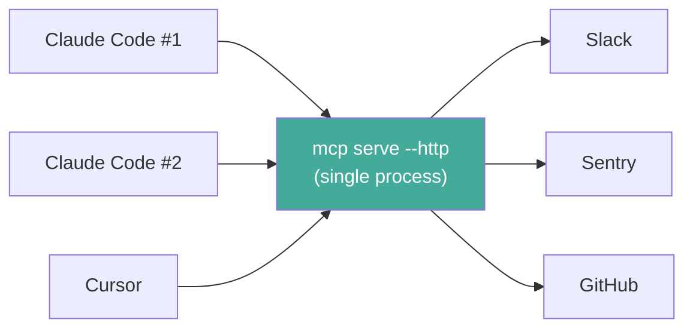
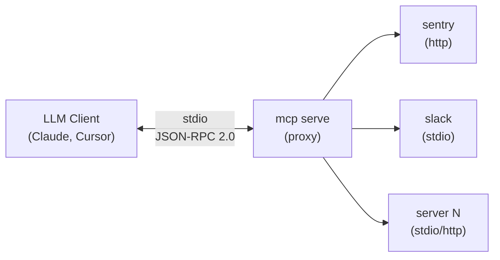
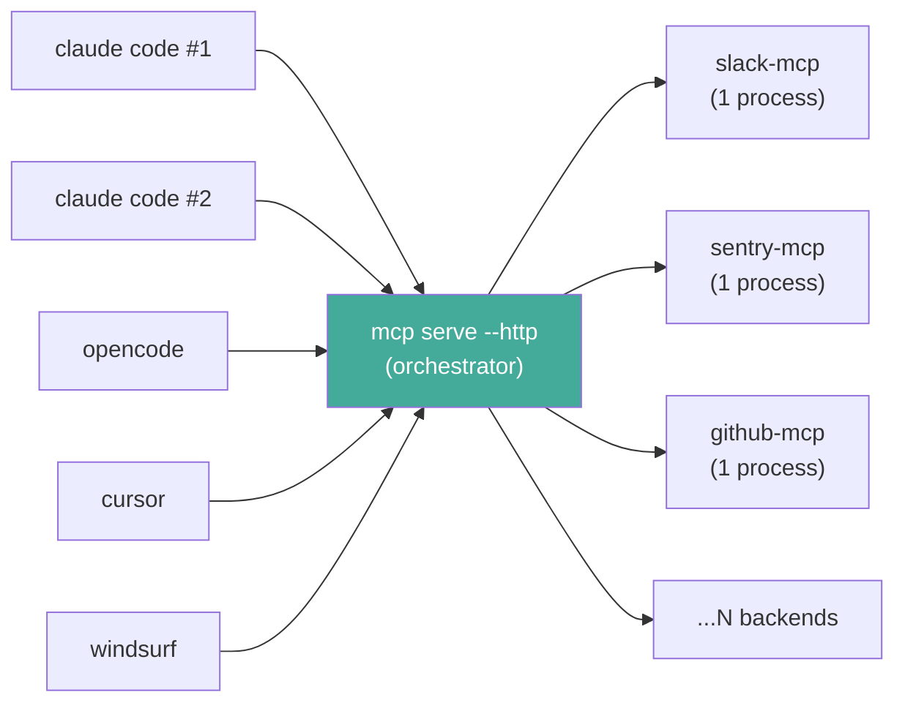
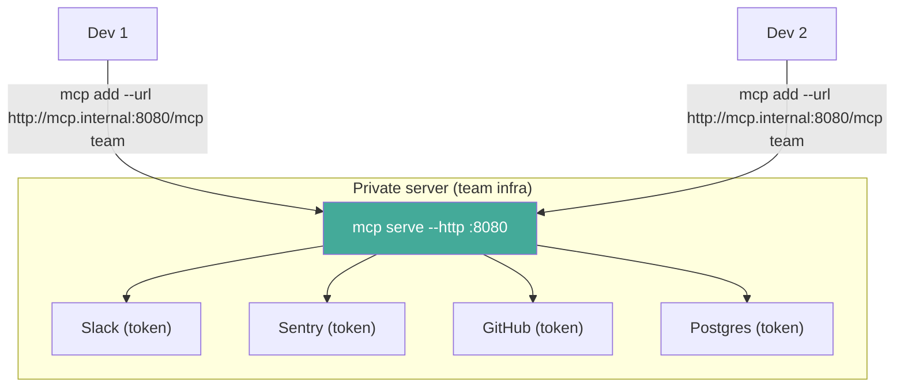
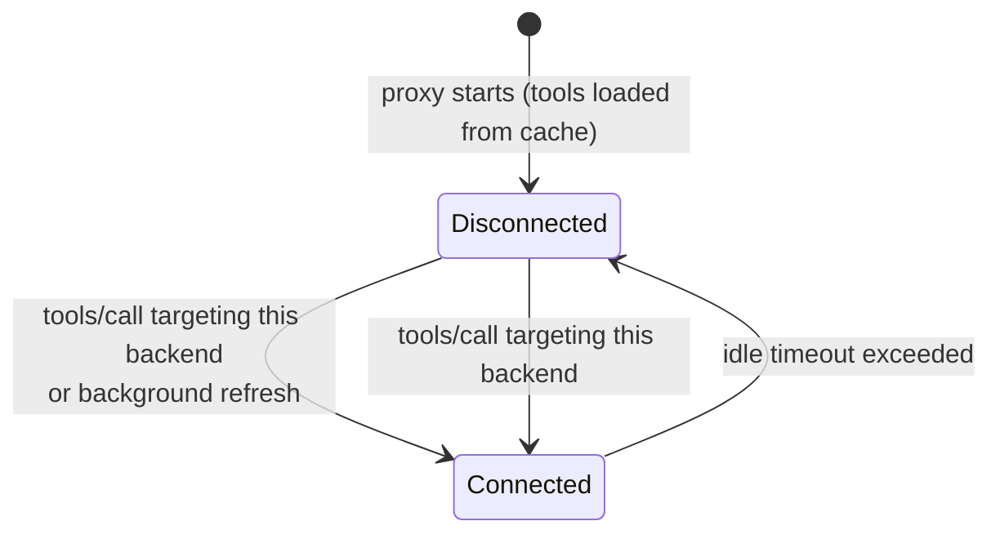

# Proxy mode

`mcp serve` starts a single MCP server that aggregates all your configured backends. Any MCP-compatible client connects once and gets access to every tool from every server in your `servers.json`.

## The problem

Without proxy mode, every LLM tool (Claude Code, Cursor, Windsurf, etc.) needs its own copy of your MCP server configuration. Add a new server? Update it in 3 places. Change a token? Same. The config drifts, breaks, and wastes time.

There's another problem: **resource waste**. When you configure MCP servers with `command` in `mcpServers`, each client session spawns its own copy of every server process. Open 5 Claude Code sessions and you get 5 copies of every MCP server — easily 3-4 GB of RAM wasted on duplicate processes.

### Stdio vs HTTP: when to use each

| Approach | How it works | Trade-off |
|----------|-------------|-----------|
| `"command": "mcp", "args": ["serve"]` | Each session spawns a new proxy (which spawns all backends) | Simple, but duplicates everything per session |
| `"type": "sse", "url": "http://…/mcp/sse"` | All sessions share one persistent proxy | One process, one set of backends, zero duplication |

**Recommendation:** Run `mcp serve --http` as a persistent service (systemd, launchd, etc.) and point all your clients to it via SSE. This gives you a single set of backend connections shared across every session, every client, every terminal.



## How it works



1. Client sends `initialize` — the proxy responds immediately with capabilities (tools, resources, prompts)
2. Client calls `tools/list`, `resources/list`, or `prompts/list` — the proxy returns items instantly from persistent cache (tools) or discovery (resources/prompts), aggregated across all backends. Each item is namespaced with `{server}__` prefix.
3. Client calls `tools/call`, `resources/read`, or `prompts/get` — the proxy reconnects the target backend on demand (if it was shut down), routes the request, and tracks usage for adaptive timeout

## Concurrency model

The proxy is built to be the **orchestration layer for N concurrent clients sharing the same set of backend processes**. This is the whole point of the project — without it, every editor session and every chat window spawns its own copy of every MCP server, multiplying RAM, CPU, and API rate-limit cost by the number of clients.

The guarantees the proxy makes:

- **One backend = one OS process**, regardless of how many clients are connected. 5 clients hitting `slack` share a single `slack-mcp-server` child.
- **Calls to different backends run in parallel.** Two clients calling `sentry__search_issues` and `github__list_repos` at the same time do not block each other.
- **Calls to the same backend also run in parallel.** The stdio transport multiplexes JSON-RPC requests on a single pipe via id matching, so 5 clients all hitting `slack__conversations_replies` simultaneously fan out and back through the same process — none of them serializes on the others.
- **A slow or hung backend only delays the requests targeting it.** The rest of the proxy keeps moving.
- **A dead client only loses its own request.** TCP keepalive (30s/10s) on the HTTP listener detects half-open sockets from crashed editors within ~60s, and `MCP_PROXY_REQUEST_TIMEOUT` (default 120s) is a final hard bound at the request boundary.
- **No orphan backends.** Every spawned child is registered with `kill_on_drop`, so a panicked task, a cancelled request, or a stalled graceful shutdown all converge on the same outcome: the child gets reaped.

You can verify the orchestration on a running proxy with `/health`:

```bash
curl -s http://127.0.0.1:7332/health | jq
```

```json
{
  "status": "ok",
  "backends_configured": 9,
  "backends_connected": 9,
  "active_clients": 5,
  "tools": 213,
  "version": "0.4.3"
}
```

`backends_connected` should never grow with `active_clients` — that's the win.



## Namespacing

Tools, resources, and prompts are prefixed with the server name using double underscore (`__`) as separator:

| Category | Server | Original | Namespaced |
|----------|--------|----------|------------|
| Tool | sentry | `search_issues` | `sentry__search_issues` |
| Resource | sentry | `issue://123` | `sentry__issue://123` |
| Prompt | slack | `summarize` | `slack__summarize` |

Descriptions are also prefixed: `[sentry] Search for issues in Sentry`.

This prevents collisions when two servers expose items with the same name or URI.

## Stdio mode (default)

```bash
mcp serve
```

That's it. It reads the same `servers.json` (or `$MCP_CONFIG_PATH`) and connects to everything.

Diagnostics go to stderr:

```
[serve] discovering tools from sentry...
[serve] discovering tools from slack...
[serve] sentry: 8 tool(s)
[serve] slack: 12 tool(s)
[serve] ready — 2 backend(s), 20 tool(s)
[serve] shutting down idle backend: sentry (idle 74s, 1 reqs)
[serve] finalizing shutdown for sentry
[serve] connecting to sentry...
[serve] sentry: 8 tool(s) (reconnected)
```

A few things to note about reaping:

- A backend is **never reaped before its first request** until `max_idle_timeout` has elapsed since connect (warm-up grace). You won't see "shutting down idle backend: X (... 0 reqs)" inside the first few minutes after start anymore — the proxy waits for X to actually be used before considering it idle.
- When the reaper does fire, all eligible backends shut down **in parallel** — 8 idle backends take ~5s, not 8 × 5s.
- If a backend's graceful shutdown stalls past 5s, you'll see `shutdown timed out — force-killed via drop`. The child is guaranteed reaped via `kill_on_drop`; the proxy never leaks orphan processes.

## HTTP mode

Expose the proxy as an HTTP server so multiple developers can share a single MCP endpoint:

```bash
mcp serve --http
```

This starts an HTTP server on `127.0.0.1:8080` (localhost only, by default).

### Custom bind address

```bash
mcp serve --http 0.0.0.0:9090 --insecure
```

> **Security:** Non-loopback addresses require the `--insecure` flag. Without TLS, binding to `0.0.0.0` exposes the proxy to the network in plaintext. Use a reverse proxy (nginx, Caddy) with TLS in production.

### Endpoints

| Method | Path | Description |
|--------|------|-------------|
| `POST` | `/mcp` | JSON-RPC 2.0 request/response (Streamable HTTP) |
| `GET` | `/mcp` | SSE stream (same as `/mcp/sse`, for backward compatibility) |
| `GET` | `/mcp/sse` | SSE stream (old HTTP+SSE transport) |
| `GET` | `/health` | Health check (JSON) |

The proxy supports both the **Streamable HTTP** transport (protocol version `2025-11-25`) and the older **HTTP+SSE** transport (`2024-11-05`) for backward compatibility.

### POST /mcp

Send any MCP JSON-RPC request and get the response. Supports both requests (with `id`) and notifications (without `id`):

```bash
# Initialize
curl -s http://localhost:8080/mcp \
  -H "Content-Type: application/json" \
  -d '{"jsonrpc":"2.0","id":1,"method":"initialize","params":{"protocolVersion":"2025-11-25","capabilities":{},"clientInfo":{"name":"test","version":"0.1"}}}'

# Send initialized notification (no id — returns 202)
curl -s http://localhost:8080/mcp \
  -H "Content-Type: application/json" \
  -d '{"jsonrpc":"2.0","method":"notifications/initialized"}'

# List tools
curl -s http://localhost:8080/mcp \
  -H "Content-Type: application/json" \
  -d '{"jsonrpc":"2.0","id":2,"method":"tools/list"}'

# Call a tool
curl -s http://localhost:8080/mcp \
  -H "Content-Type: application/json" \
  -d '{"jsonrpc":"2.0","id":3,"method":"tools/call","params":{"name":"sentry__search_issues","arguments":{"query":"is:unresolved"}}}'
```

When used with an SSE session (`?session_id=<uuid>`), responses are delivered via the SSE stream and the POST returns `202 Accepted`.

### GET /mcp/sse

SSE endpoint for clients that use the old HTTP+SSE transport (protocol version `2024-11-05`). On connect, the server sends an `endpoint` event with the URL to POST requests to:

```
event: endpoint
data: /mcp?session_id=<uuid>
```

JSON-RPC responses are delivered as `message` events on the SSE stream. The connection stays open with periodic pings (every 15 seconds) to keep it alive. Sessions are cleaned up automatically when the client disconnects.

### GET /health

Returns the proxy status, including backend pool size and live client sessions:

```json
{
  "status": "ok",
  "backends_configured": 9,
  "backends_connected": 9,
  "active_clients": 5,
  "tools": 213,
  "version": "0.4.3"
}
```

`active_clients` is the number of SSE sessions currently registered. Combined with `backends_connected`, this is the metric that proves the proxy is doing its job: **N clients sharing M backends, not N × M processes**. If you ever see `backends_connected` grow proportionally to `active_clients`, something is wrong (clients should be hitting the proxy, not bypassing it to spawn their own backends).

### Graceful shutdown

The HTTP server shuts down cleanly on `SIGTERM` or `SIGINT` (Ctrl+C). It stops accepting new connections, finishes in-flight requests, and disconnects all backends.

### Team setup

Run one proxy server on shared infrastructure. Every developer connects to it:



Tokens stay on the server. Developers just connect. For a deeper look at the enterprise use case, see [Enterprise token management](enterprise-token-management.md).

## Client configuration

### Claude Code (stdio)

In your Claude Code MCP settings (`.claude/mcp.json` or via Claude Code settings):

```json
{
  "mcpServers": {
    "all": {
      "command": "mcp",
      "args": ["serve"]
    }
  }
}
```

### Claude Code (HTTP — shared server)

Use the SSE transport type pointing to the `/mcp/sse` endpoint:

```json
{
  "mcpServers": {
    "team": {
      "type": "sse",
      "url": "http://localhost:8080/mcp/sse"
    }
  }
}
```

> **Note:** The Streamable HTTP transport (`type: "http"`) requires OAuth which is not yet supported. Use `type: "sse"` for now.

### Cursor (stdio)

In `.cursor/mcp.json`:

```json
{
  "mcpServers": {
    "mcp-proxy": {
      "command": "mcp",
      "args": ["serve"]
    }
  }
}
```

### Cursor (HTTP — shared server)

```json
{
  "mcpServers": {
    "team": {
      "url": "http://mcp.internal:8080/mcp"
    }
  }
}
```

### Windsurf

In your Windsurf MCP config:

```json
{
  "mcpServers": {
    "mcp-proxy": {
      "command": "mcp",
      "args": ["serve"]
    }
  }
}
```

### Any MCP client (generic stdio)

Any client that supports stdio transport can use it. The proxy speaks standard JSON-RPC 2.0 over MCP protocol on stdin/stdout.

```bash
# Manual test — list tools
echo '{"jsonrpc":"2.0","id":1,"method":"initialize","params":{"protocolVersion":"2025-11-25","capabilities":{},"clientInfo":{"name":"test","version":"0.1"}}}' | mcp serve 2>/dev/null
```

### Any MCP client (HTTP)

Any client that supports HTTP transport can connect to the HTTP endpoint:

```bash
mcp add --url http://localhost:8080/mcp local-proxy
```

## Persistent tool cache

The proxy caches discovered tools in a local [ChronDB](https://chrondb.avelino.run/) database so that subsequent startups serve tools instantly — no need to wait for backends to connect.

### How it works

On startup, the proxy loads cached tools and serves them immediately. A background task then connects to real backends to refresh the cache. If a backend's configuration changes (detected via SHA-256 hash), its cached entry is invalidated and re-discovered.

First run with no cache: `tools/list` falls back to blocking full discovery (connecting to all backends before responding). However, `tools/call` uses per-server lazy discovery — it infers the target backend from the namespaced tool name and discovers only that server, so it avoids triggering full discovery of unrelated backends, though it can still be delayed if another discovery is already in progress.

### Cache invalidation

The cache is invalidated per-backend when:
- The backend's config in `servers.json` changes (command, args, url, env, etc.)
- The backend is removed from config (cache entry is ignored)

Cache location: `~/.config/mcp/db/` (shared database with audit logs, separated by key prefix).

## Lazy initialization and idle shutdown

The proxy does **not** keep all backends running permanently. It uses a lazy initialization strategy combined with adaptive idle shutdown to minimize resource usage.

### How it works



1. **Startup** — No backends are connected. Cached tools are loaded from the local database and served immediately.
2. **Background refresh** — The proxy connects to all backends in the background, refreshes tool lists, and updates the cache. Clients are not blocked.
3. **Idle shutdown** — A background task checks every 30 seconds for idle backends. If a backend exceeds its idle timeout, it is shut down. Its tools remain visible in `tools/list`.
4. **On-demand reconnect** — When `tools/call` targets a disconnected backend, the proxy reconnects it transparently, refreshes the tool cache, and forwards the request.

Usage statistics (request count, frequency) are preserved across reconnections, so the adaptive timeout algorithm maintains continuity.

### Adaptive timeout tiers

The default idle timeout is `adaptive`. The proxy classifies each backend by its usage frequency:

| Tier | Requests/hour | Idle timeout |
|------|--------------|-------------|
| **Hot** | > 20 | 5 min |
| **Warm** | 5–20 | 3 min |
| **Cold** | < 5 | 1 min |

Backends with fewer than 2 requests use the minimum timeout (default: 1 min).

### Configuring idle timeout

Per-backend in `servers.json`:

```json
{
  "mcpServers": {
    "slack": {
      "command": "npx",
      "args": ["@anthropic/mcp-slack"],
      "idle_timeout": "adaptive"
    },
    "sentry": {
      "url": "https://mcp.sentry.io",
      "idle_timeout": "never"
    },
    "github": {
      "command": "npx",
      "args": ["@modelcontextprotocol/server-github"],
      "idle_timeout": "2m",
      "min_idle_timeout": "30s",
      "max_idle_timeout": "5m"
    }
  }
}
```

| Value | Behavior |
|-------|----------|
| `"adaptive"` (default) | Usage-based timeout with automatic tier assignment |
| `"never"` | Keep alive forever (old behavior) |
| `"<duration>"` | Fixed timeout (e.g. `"2m"`, `"30s"`, `"1h"`) |

See the [config file reference](../reference/config-file.md#idle-timeout) for full details.

### Why this matters

With 10 MCP servers configured and 3 Claude Code sessions open:
- **Before:** 30 backend processes running permanently (~3-4 GB RAM)
- **After:** Only the backends you're actively using stay alive. Idle ones are shut down within 1-5 minutes and reconnected on demand.

## Error handling

- **Backend fails to connect** — logged to stderr, skipped. Other backends still work.
- **Backend disconnected (idle shutdown)** — `tools/call` reconnects the backend transparently. If reconnection fails, returns an MCP error with context.
- **Backend disconnects mid-session** — `tools/call` returns an MCP error with context about which backend failed.
- **Unknown tool** — returns a JSON-RPC error with the unknown tool name.
- **Malformed JSON-RPC** — HTTP mode returns a parse error with details. Stdio mode silently ignores.

The proxy never crashes because one backend is down. It degrades gracefully.

## Authentication

The proxy supports server-side authentication for HTTP mode. Authentication is configured via `serverAuth` in `servers.json`.

### No auth (default)

By default, no authentication is required. This is suitable for local development and stdio mode.

> **Schema.** `serverAuth.providers` is a `Vec<String>`. List one or many — the proxy runs them as a chain, accepting the first identity that validates. Empty list (or omitted) = anonymous (`NoAuth`). The legacy `provider: "..."` single-string field is no longer accepted; configs that still carry it boot as `NoAuth`.

### Bearer token auth

Static token-to-user mapping. Each token maps to a subject identity:

```json
{
  "mcpServers": { ... },
  "serverAuth": {
    "providers": ["bearer"],
    "bearer": {
      "tokens": {
        "secret-token-abc": "alice",
        "secret-token-def": "bob"
      }
    }
  }
}
```

Clients pass the token in the `Authorization` header:

```bash
curl -s http://localhost:8080/mcp \
  -H "Authorization: Bearer secret-token-abc" \
  -H "Content-Type: application/json" \
  -d '{"jsonrpc":"2.0","id":1,"method":"tools/list"}'
```

### Forwarded user auth

Trusts a reverse proxy header (e.g. `X-Forwarded-User`). Only use behind a trusted proxy that sets this header:

```json
{
  "mcpServers": { ... },
  "serverAuth": {
    "providers": ["forwarded"],
    "forwarded": {
      "header": "x-forwarded-user"
    }
  }
}
```

### OAuth Authorization Server

Lets Claude.ai, ChatGPT, Cursor and other AI clients connect as Custom Connectors via OAuth 2.0 + Dynamic Client Registration. Combine with `bearer` to keep static tokens working for local dev on the same instance:

```json
{
  "serverAuth": {
    "providers": ["bearer", "oauth_as"],
    "bearer": { "tokens": { "tok-local-dev": { "subject": "avelino", "roles": ["admin"] } } },
    "oauthAs": {
      "issuerUrl": "https://mcp.example.com",
      "jwtSecret": "${MCP_OAUTH_AS_JWT_SECRET}",
      "trustedSourceCidrs": ["10.0.0.0/8"],
      "redirectUriAllowlist": ["https://claude.ai/api/mcp/auth_callback"],
      "injectedRoles": ["oauth-user"]
    }
  }
}
```

Full setup, security notes, and troubleshooting in the [OAuth AS how-to](../howto/oauth-as.md).

### Access control (ACL)

The ACL supports two schemas: a **role-based schema** (recommended) and a **legacy schema** (for backward compatibility). Detection is automatic based on the JSON keys present.

#### Role-based schema (recommended)

Define reusable roles with server-aware, read/write-aware grants:

```json
{
  "mcpServers": { ... },
  "serverAuth": {
    "providers": ["bearer"],
    "bearer": {
      "tokens": {
        "tok-alice": { "subject": "alice", "roles": ["admin"] },
        "tok-bob": { "subject": "bob", "roles": ["dev"] },
        "tok-charlie": { "subject": "charlie", "roles": ["readonly"] }
      }
    },
    "acl": {
      "default": "deny",
      "strictClassification": false,
      "roles": {
        "admin":    [{ "server": "*", "access": "*" }],
        "dev": [
          { "server": ["github", "grafana"], "access": "read" },
          { "server": "github", "access": "write", "tools": ["gh_pr", "gh_issue"] }
        ],
        "readonly": [{ "server": "*", "access": "read" }]
      },
      "subjects": {
        "charlie": {
          "roles": ["readonly"],
          "extra": [{ "server": "sentry", "access": "read" }]
        }
      }
    }
  }
}
```

**How it works:**

- **`roles`** — Map of role name to a list of grants. Roles are reusable and referenced by subjects.
- **`subjects`** — Map of subject identifier to `{ roles, extra }`. Roles reference entries in the top-level `roles` map. `extra` is a per-subject list of additional grants.
- **Evaluation is union-based** — collect all grants from all roles the identity has (token roles + subject config roles + extra). If any grant with `deny: true` matches, access is denied. Otherwise, if any allow grant matches, access is allowed. No match falls back to `default`.
- **Order doesn't matter** — unlike the legacy schema, rules are not position-sensitive.

**Grant fields:**

| Field | Type | Description |
|-------|------|-------------|
| `server` | string or string[] | Server alias(es) to match. `"*"` matches any server. |
| `access` | `"read"` \| `"write"` \| `"*"` | Access level (see below) |
| `tools` | string[] | Optional tool name globs to narrow the grant. Empty = all tools. |
| `resources` | string[] | Optional resource URI globs to narrow the grant. Empty = all resources. Enforced on `resources/list` (filtering) and `resources/read` (gating). |
| `prompts` | string[] | Optional prompt name globs to narrow the grant. Empty = all prompts. Enforced on `prompts/list` (filtering) and `prompts/get` (gating). |
| `deny` | bool | If `true`, turns this into an explicit deny that always wins over allows |

**Access expansion:**

The `access` field interacts with the tool classifier (read/write/ambiguous):

| `access` | Read tools | Write tools | Ambiguous tools |
|-----------|-----------|-------------|-----------------|
| `"read"` | allowed | denied | denied |
| `"write"` | denied | allowed | allowed |
| `"*"` | allowed | allowed | allowed |

When `strictClassification: true`, ambiguous tools are blocked entirely — regardless of access level (including `"*"`). This forces explicit classification overrides in the server config before ambiguous tools can be used.

**Deny always wins:**

```json
{
  "roles": {
    "dev": [
      { "server": "github", "access": "*" },
      { "server": "github", "access": "write", "tools": ["gh_repo_delete"], "deny": true }
    ]
  }
}
```

The `dev` role has full access to github, except `gh_repo_delete` is explicitly denied.

#### Legacy schema

The original flat rules list, still fully supported. Detected when `rules` is present in the ACL config:

```json
{
  "acl": {
    "default": "allow",
    "rules": [
      { "subjects": ["bob"], "tools": ["sentry__*"], "policy": "deny" },
      { "subjects": ["bob"], "tools": ["*admin*"], "policy": "deny" },
      { "roles": ["admin"], "tools": ["*"], "policy": "allow" }
    ]
  }
}
```

Rules are evaluated in order — **first match wins**. If no rule matches, the default policy applies.

Legacy ACL fields:
- `subjects` — list of user subjects to match (supports `*` wildcard)
- `roles` — list of roles to match (supports `*` wildcard)
- `tools` — list of tool name patterns (supports `*` wildcards: prefix `sentry__*`, suffix `*_issues`, contains `*admin*`, multiple `sentry__*_admin__*`, exact match, or `*` for all)
- `policy` — `allow` or `deny`

Both `subjects` and `roles` must match for a rule to apply. Empty `subjects` or `roles` means "match all".

#### Schema detection

| JSON keys present | Schema used |
|-------------------|-------------|
| `roles` (as object) or `subjects` (as object) | Role-based |
| `rules` (as array) | Legacy |
| Both `rules` and `roles`/`subjects` | Config error (fails loudly) |
| Neither | Legacy with default allow |

> **Note:** Stdio mode always uses anonymous identity. ACL rules still apply but the subject is always "anonymous".

### ACL enforcement points

The ACL is enforced at every dispatch point in the proxy:

1. **`tools/list`** — The response is **filtered** to only include tools the identity is allowed to call. A tool the identity cannot reach is invisible in the listing.
2. **`tools/call`** — The request is checked against the ACL before it reaches the backend. Denied requests return a JSON-RPC error (`-32603`) with the subject and tool name.
3. **`resources/list`** — Filtered to only include resources matching the identity's grants.
4. **`resources/read`** — Checked against the ACL before forwarding to the backend.
5. **`prompts/list`** — Filtered to only include prompts matching the identity's grants.
6. **`prompts/get`** — Checked against the ACL before forwarding to the backend.

This dual enforcement (listing filter + request gate) applies to all three categories. An unauthorized identity can't discover names via listing and can't bypass the filter by guessing names.

**Legacy schema behavior for resources/prompts:** Listing is always allowed regardless of the `default` policy. Only `resources/read` and `prompts/get` respect `default: deny`. This ensures legacy users migrating from tools-only configs don't lose visibility into what's available.

### Request timeout

Each client request has a hard upper bound of 120 seconds (configurable via `MCP_PROXY_REQUEST_TIMEOUT`). If a backend takes longer, the client gets a JSON-RPC error and the in-flight request is dropped. Other concurrent clients are unaffected.

```bash
MCP_PROXY_REQUEST_TIMEOUT=300 mcp serve --http
```

### Discovery retry with backoff

When a backend fails to connect during discovery, the proxy applies exponential backoff: 30s → 60s → 120s → 240s (capped at 300s). This prevents a flaky backend from repeatedly stealing the discovery lock and blocking healthy backends. After the backoff expires, the proxy retries on the next `tools/call` or discovery cycle. Success clears the backoff. Backoff is checked per-backend — a `tools/call` targeting a healthy server is never delayed by another server's backoff state.

## Security considerations

### Localhost-only by default

HTTP mode binds to `127.0.0.1` by default. This is safe for local development — only processes on the same machine can reach it.

### Non-loopback binding

To expose the proxy on the network, you must explicitly opt in:

```bash
mcp serve --http 0.0.0.0:8080 --insecure
```

The `--insecure` flag acknowledges the risk of plaintext HTTP on a network interface.

### Production deployment

For production, put a reverse proxy in front:

```
Internet → nginx/Caddy (TLS + auth) → mcp serve --http 127.0.0.1:8080
```

This gives you:
- TLS termination
- Authentication (bearer tokens or forwarded user)
- Rate limiting
- Access logging

### Token isolation

Backend tokens (Slack, GitHub, etc.) live in `servers.json` on the proxy server. They are never exposed to clients. Only tool results are forwarded.

## Environment variables

All standard `mcp` env vars apply:

| Variable | Default | Effect |
|----------|---------|--------|
| `MCP_CONFIG_PATH` | `~/.config/mcp/servers.json` | Custom config file path |
| `MCP_TIMEOUT` | `60` | Timeout in seconds for backend connections |
| `MCP_PROXY_REQUEST_TIMEOUT` | `120` | Hard upper bound (seconds) per client request in proxy mode |
| `MCP_CLASSIFIER_CACHE` | `~/.config/mcp/tool-classification.json` | Path to the tool classification cache |

See [environment variables reference](../reference/environment-variables.md) for full details.

## When to use each mode

| Scenario | Mode |
|----------|------|
| Single session, quick test | `mcp serve` (stdio) |
| Multiple sessions on same machine | `mcp serve --http` + SSE clients |
| Team sharing one MCP endpoint | `mcp serve --http` + SSE clients |
| CI/CD pipeline calling tools | `mcp serve --http` + curl |
| Production with auth & TLS | `mcp serve --http` + reverse proxy |
| Calling one tool from a script | `mcp <server> <tool>` directly |

> **If you regularly open multiple Claude Code sessions**, use HTTP mode as a persistent service. Stdio mode spawns a full copy of every backend per session — HTTP mode shares one.
